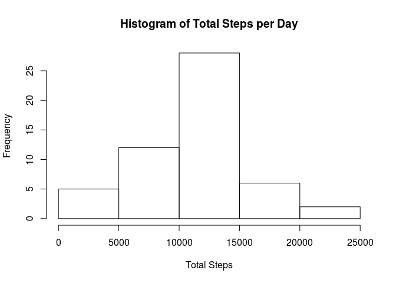
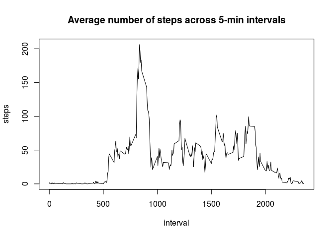
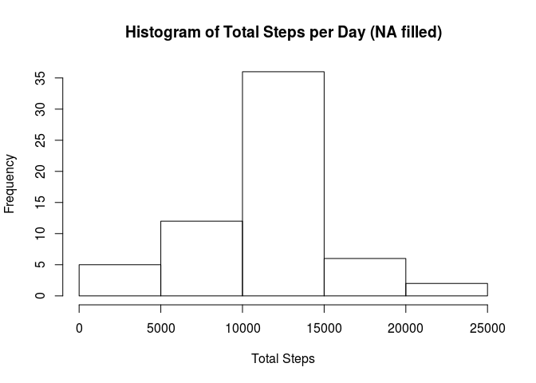
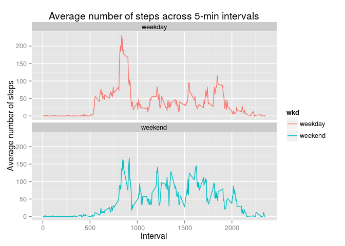

# Reproducible Research: Peer Assessment 1

### Loading and preprocessing the data
Download ZIP file with data archive, unpack and read CSV.

```r
temp <- tempfile()
download.file("https://d396qusza40orc.cloudfront.net/repdata%2Fdata%2Factivity.zip", method="curl", temp)
activity <- read.csv(unz(temp, "activity.csv"), sep=",",  header = TRUE, stringsAsFactors=FALSE)
unlink(temp)
```

### What is mean total number of steps taken per day?
Aggregate steps by date, and then plot a histogram and calculate the mean and median values of total steps per day:

```r
stepsbyday<-aggregate(steps~date, activity, sum)
hist(stepsbyday$steps, breaks=5, main="Histogram of Total Steps per Day", xlab="Total Steps")
```

 

```r
stmean<-mean(stepsbyday$steps); stmed<-median(stepsbyday$steps)
```
Mean value of the total number of steps taken per day is 10766, while median is 10765

### What is the average daily activity pattern?'
Plot average number of steps taken, averaged across all days, as a time series of a 5-minute intervals:


```r
stepsbyint<-aggregate(steps~interval, activity, mean)
plot(stepsbyint, type="l", main="Average number of steps across 5-min intervals")
```

 

```r
maxint<-stepsbyint[which(stepsbyint$steps==max(stepsbyint$steps)),]$interval
```
Maximum number of steps on average across all the days in the dataset occurs at interval 835.

### Imputing missing values
There are a number of days/intervals where there are missing values (coded as NA). The presence of missing days may introduce bias into some calculations or summaries of the data.


```r
nasteps<-sum(is.na(activity$steps))
```
Total number of missing values in the dataset is 2304. We replace these NA values by mean number of steps for respective 5-minute interval across al days. This code creates a new dataset that is equal to the original dataset but with the missing data filled in. We assume every day contains the same number of intervals, and this seems to be true. Then, we can add a column with mean number of steps by interval to original dataset.

```r
noNAactivity<-activity
noNAactivity$date<-as.Date(noNAactivity$date)
noNAactivity$meansteps<-round(stepsbyint$steps, 0)
# This new column will hold a mean value of steps for NA rows, and 0 for the rest of rows:
noNAactivity$meansteps<-noNAactivity$meansteps*(is.na(noNAactivity$steps))
# Replace NA with 0, and then sum 'steps' and 'meansteps' columns:
noNAactivity$steps[which(is.na(noNAactivity$steps))] <-0
noNAactivity$steps<-noNAactivity$steps+noNAactivity$meansteps
noNAactivity$meansteps<-NULL
```

Make a histogram of the total number of steps taken each day and Calculate and report the mean and median total number of steps taken per day. Do these values differ from the estimates from the first part of the assignment? What is the impact of imputing missing data on the estimates of the total daily number of steps?


```r
stepsbyday<-aggregate(steps~date, noNAactivity, sum)
hist(stepsbyday$steps, breaks=5, main="Histogram of Total Steps per Day (NA filled)", xlab="Total Steps")
```

 

```r
stmean<-mean(stepsbyday$steps); stmed<-median(stepsbyday$steps)
```
Mean value of the total number of steps taken per day is 10766, while median is 10762. Mean value is not changed, while median is slightly lower than before - this is the impact of filling NA values by average for respective interval. These NA occured at periods of low activity, and adding more low values moves median down.

### Are there differences in activity patterns between weekdays and weekends?
Create a new factor variable in the dataset with two levels – “weekday” and “weekend” indicating whether a given date is a weekday or weekend day.


```r
noNAactivity$wkd<-weekdays(noNAactivity$date)
noNAactivity$wkd<-sub("Monday|Tuesday|Wednesday|Thursday|Friday", "weekday", noNAactivity$wkd)
noNAactivity$wkd<-sub("Sunday|Saturday", "weekend", noNAactivity$wkd)
noNAactivity$wkd<-factor(noNAactivity$wkd)
```

Make a panel plot containing a time series plot (i.e. type = "l") of the 5-minute interval (x-axis) and the average number of steps taken, averaged across all weekday days or weekend days (y-axis).

```r
library(ggplot2)
qplot(interval, steps, data = noNAactivity, stat="summary", fun.y = "mean", geom="line", color=wkd, ylab="Average number of steps", main="Average number of steps across 5-min intervals")+facet_wrap(~wkd, nrow=2)
```

 
  
Activity patterns for weekdays and weekend are slightly different. At weekend, activity starts later, and is higher throughout the day. Peak activity occurs in the weekdays morning, between 8:30 and 9:30 AM.
